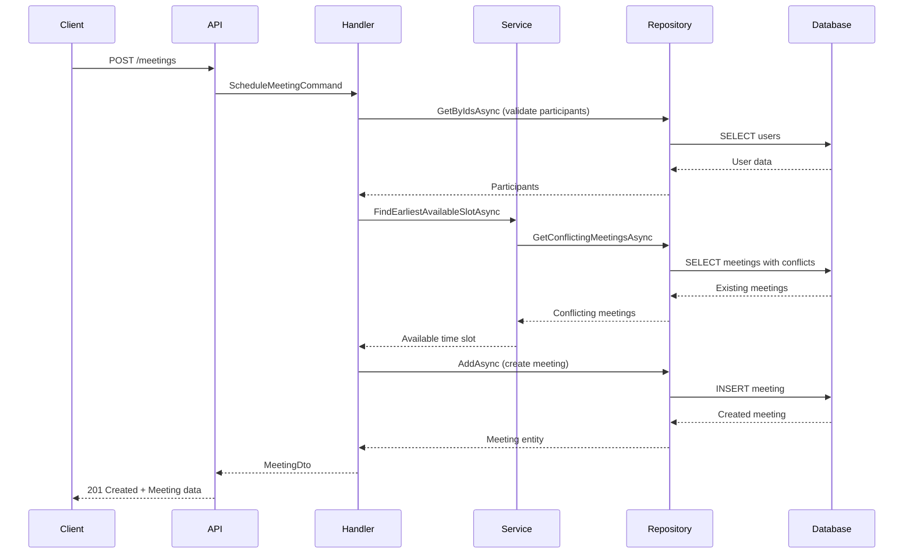
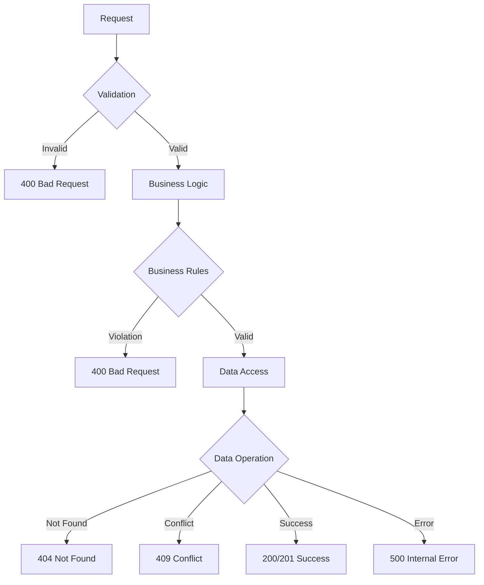

# Architecture Documentation

This document provides a comprehensive overview of the Meeting Scheduler system architecture, design decisions, and implementation patterns.

## System Overview

The Meeting Scheduler is a RESTful API service built using Clean Architecture principles with ASP.NET Core. It provides conflict-free meeting scheduling capabilities for multiple participants while enforcing business rules and maintaining data consistency.

## Architectural Principles

### Clean Architecture

The system follows Uncle Bob's Clean Architecture pattern with clear separation of concerns:

```
┌─────────────────────────────────────────────────────────────┐
│                     Presentation Layer                     │
│                  (Web.Api - Controllers)                   │
├─────────────────────────────────────────────────────────────┤
│                    Application Layer                        │
│           (CQRS Handlers, Services, Interfaces)           │
├─────────────────────────────────────────────────────────────┤
│                   Infrastructure Layer                     │
│        (Repositories, Database, External Services)        │
├─────────────────────────────────────────────────────────────┤
│                      Domain Layer                          │
│              (Entities, Value Objects, Events)            │
└─────────────────────────────────────────────────────────────┘
```

### Dependency Inversion

Dependencies flow inward toward the domain:

- **Presentation** depends on **Application**
- **Application** depends on **Domain**
- **Infrastructure** depends on **Application** and **Domain**
- **Domain** has no external dependencies

## Layer Details

### Domain Layer (`src/Domain`)

The core business logic layer containing:

#### Entities

**MeetingUser Entity:**

```csharp
public sealed class MeetingUser : Entity
{
    public int Id { get; }
    public string Name { get; private set; }

    // Business rules and validation
    private static void ValidateName(string name);
}
```

**Meeting Entity:**

```csharp
public sealed class Meeting : Entity
{
    public int Id { get; }
    public IReadOnlyList<int> ParticipantIds { get; }
    public DateTime StartTime { get; private set; }
    public DateTime EndTime { get; private set; }

    // Business rules
    public bool HasConflictWith(Meeting other);
    public bool IsWithinBusinessHours();
    private static void ValidateBusinessHours(DateTime start, DateTime end);
}
```

#### Domain Events

```csharp
public sealed record UserCreatedDomainEvent(int UserId, string Name) : IDomainEvent;
public sealed record MeetingScheduledDomainEvent(int MeetingId, List<int> ParticipantIds, DateTime StartTime, DateTime EndTime) : IDomainEvent;
```

#### Business Rules

1. **Meeting Time Validation**: Start time must be before end time
2. **Business Hours**: Meetings must be within 09:00-17:00 UTC
3. **Participant Validation**: At least one participant required, no duplicates
4. **Name Validation**: User names must be 1-100 characters

### Application Layer (`src/Application`)

Orchestrates business logic and handles cross-cutting concerns.

#### CQRS Pattern

**Commands (Write Operations):**

```csharp
public record CreateUserCommand(string Name) : ICommand<UserDto>;
public record ScheduleMeetingCommand(
    List<int> ParticipantIds,
    int DurationMinutes,
    DateTime EarliestStart,
    DateTime LatestEnd) : ICommand<MeetingDto>;
```

**Queries (Read Operations):**

```csharp
public record GetUserMeetingsQuery(int UserId) : IQuery<List<MeetingDto>>;
```

**Handlers:**

```csharp
internal sealed class CreateUserCommandHandler : ICommandHandler<CreateUserCommand, UserDto>
{
    // Implementation with validation, business logic, and persistence
}
```

#### Domain Services

**Meeting Scheduler Service:**

```csharp
public interface IMeetingSchedulerService
{
    Task<DateTime?> FindEarliestAvailableSlotAsync(
        List<int> participantIds,
        int durationMinutes,
        DateTime earliestStart,
        DateTime latestEnd);
}
```

**Algorithm Implementation:**

1. Validate input parameters
2. Retrieve existing meetings for participants
3. Generate potential time slots (15-minute increments)
4. Check business hours compliance
5. Verify no conflicts with existing meetings
6. Return earliest available slot

#### Repository Interfaces

```csharp
public interface IMeetingUserRepository
{
    Task<MeetingUser?> GetByIdAsync(int id, CancellationToken cancellationToken = default);
    Task<MeetingUser> AddAsync(MeetingUser user, CancellationToken cancellationToken = default);
    Task<List<MeetingUser>> GetByIdsAsync(List<int> ids, CancellationToken cancellationToken = default);
}

public interface IMeetingRepository
{
    Task<Meeting> AddAsync(Meeting meeting, CancellationToken cancellationToken = default);
    Task<List<Meeting>> GetUserMeetingsAsync(int userId, CancellationToken cancellationToken = default);
    Task<List<Meeting>> GetConflictingMeetingsAsync(List<int> participantIds, DateTime start, DateTime end, CancellationToken cancellationToken = default);
}
```

### Infrastructure Layer (`src/Infrastructure`)

Implements external concerns and technical details.

#### Database Configuration

**Entity Framework Context:**

```csharp
public sealed class ApplicationDbContext : DbContext, IApplicationDbContext
{
    public DbSet<MeetingUser> MeetingUsers { get; set; }
    public DbSet<Meeting> Meetings { get; set; }

    // Domain event publishing on save
    public override async Task<int> SaveChangesAsync(CancellationToken cancellationToken = default);
}
```

**Entity Configurations:**

```csharp
internal sealed class MeetingConfiguration : IEntityTypeConfiguration<Meeting>
{
    public void Configure(EntityTypeBuilder<Meeting> builder)
    {
        // Table mapping, constraints, indexes
        builder.HasIndex(m => m.StartTime);
        builder.HasIndex(m => m.EndTime);
        builder.HasIndex(m => new { m.StartTime, m.EndTime }); // Composite index
    }
}
```

#### Repository Implementations

```csharp
internal sealed class MeetingRepository : IMeetingRepository
{
    private readonly IApplicationDbContext _context;
    private readonly ILogger<MeetingRepository> _logger;

    // Efficient queries with proper indexing
    public async Task<List<Meeting>> GetConflictingMeetingsAsync(
        List<int> participantIds,
        DateTime start,
        DateTime end,
        CancellationToken cancellationToken = default)
    {
        return await _context.Meetings
            .Where(m => m.StartTime < end && m.EndTime > start)
            .Where(m => m.ParticipantIds.Any(id => participantIds.Contains(id)))
            .ToListAsync(cancellationToken);
    }
}
```

#### Logging Infrastructure

**Serilog Configuration:**

- Structured logging with correlation IDs
- Multiple sinks (Console, Seq, File)
- Environment-specific log levels
- Performance monitoring

### Presentation Layer (`src/Web.Api`)

HTTP API interface with minimal endpoints pattern.

#### Endpoint Implementation

```csharp
internal sealed class ScheduleMeeting : IEndpoint
{
    public void MapEndpoint(IEndpointRouteBuilder app)
    {
        app.MapPost("meetings", async (
            ScheduleMeetingRequest request,
            ICommandHandler<ScheduleMeetingCommand, MeetingDto> handler,
            ILogger<ScheduleMeeting> logger,
            CancellationToken cancellationToken) =>
        {
            // Request logging, command creation, error handling
        });
    }
}
```

#### Middleware Pipeline

```csharp
// Program.cs middleware order
app.UseCorrelationId();           // Request tracking
app.UsePerformanceLogging();      // Performance monitoring
app.UseRequestContextLogging();   // Request context
app.UseSerilogRequestLogging();   // Structured logging
app.UseExceptionHandler();        // Global error handling
app.UseAuthentication();          // Authentication (future)
app.UseAuthorization();           // Authorization (future)
```

## Data Flow

### Meeting Scheduling Flow



### Error Handling Flow



## Design Patterns

### Repository Pattern

Abstracts data access logic:

```csharp
// Interface in Application layer
public interface IMeetingRepository
{
    Task<List<Meeting>> GetConflictingMeetingsAsync(/*...*/);
}

// Implementation in Infrastructure layer
internal sealed class MeetingRepository : IMeetingRepository
{
    // EF Core implementation
}
```

### CQRS (Command Query Responsibility Segregation)

Separates read and write operations:

```csharp
// Commands modify state
public record CreateUserCommand(string Name) : ICommand<UserDto>;

// Queries read state
public record GetUserMeetingsQuery(int UserId) : IQuery<List<MeetingDto>>;
```

### Domain Events

Decoupled communication within the domain:

```csharp
public sealed class Meeting : Entity
{
    public Meeting(/*...*/)
    {
        // Business logic
        Raise(new MeetingScheduledDomainEvent(Id, participantIds, startTime, endTime));
    }
}
```

### Dependency Injection

Loose coupling through interfaces:

```csharp
// Registration in Infrastructure
services.AddScoped<IMeetingRepository, MeetingRepository>();
services.AddScoped<IMeetingSchedulerService, MeetingSchedulerService>();

// Usage in Application
public class ScheduleMeetingCommandHandler
{
    public ScheduleMeetingCommandHandler(
        IMeetingSchedulerService schedulerService,
        IMeetingRepository meetingRepository)
    {
        // Dependencies injected
    }
}
```

## Performance Considerations

### Database Optimization

**Indexing Strategy:**

```sql
-- Time-based queries
CREATE INDEX ix_meetings_start_time ON meetings (start_time);
CREATE INDEX ix_meetings_end_time ON meetings (end_time);

-- Range queries
CREATE INDEX ix_meetings_start_time_end_time ON meetings (start_time, end_time);
```

**Query Optimization:**

- Efficient conflict detection queries
- Proper use of Entity Framework query methods
- Avoiding N+1 query problems

### Caching Strategy

**In-Memory Caching (Future Enhancement):**

```csharp
public class CachedMeetingRepository : IMeetingRepository
{
    private readonly IMeetingRepository _repository;
    private readonly IMemoryCache _cache;

    // Cache frequently accessed data
}
```

### Algorithm Efficiency

**Scheduling Algorithm:**

- 15-minute slot increments for efficiency
- Early termination when slot found
- Minimal database queries
- O(n) complexity for conflict checking

## Security Architecture

### Current Security Measures

1. **Input Validation**: All inputs validated at API boundary
2. **SQL Injection Prevention**: Parameterized queries via EF Core
3. **Business Rule Enforcement**: Domain-level validation
4. **Error Handling**: No sensitive information in error responses

### Future Security Enhancements

```csharp
// Authentication middleware
app.UseAuthentication();

// Authorization policies
[Authorize(Policy = "CanScheduleMeetings")]
public class ScheduleMeeting : IEndpoint
{
    // Implementation
}

// Rate limiting
app.UseRateLimiter();
```

## Monitoring and Observability

### Structured Logging

**Log Levels:**

- **Debug**: Algorithm details, database queries
- **Information**: Business operations, successful requests
- **Warning**: Business rule violations, slow requests
- **Error**: Exceptions, system failures

**Correlation IDs:**

```csharp
public class CorrelationIdMiddleware
{
    public async Task InvokeAsync(HttpContext context)
    {
        string correlationId = GetOrCreateCorrelationId(context);
        using (LogContext.PushProperty("CorrelationId", correlationId))
        {
            await _next(context);
        }
    }
}
```

### Performance Monitoring

**Metrics Collected:**

- Request duration
- Database query timing
- Scheduling algorithm performance
- Memory usage
- Error rates

### Health Checks

```csharp
services.AddHealthChecks()
    .AddNpgSql(connectionString, name: "meeting-scheduler-db")
    .AddCheck("meeting-scheduler-inmemory", () =>
        HealthCheckResult.Healthy("In-memory database is available"));
```

## Testing Strategy

### Test Pyramid

```
    ┌─────────────────┐
    │  Integration    │  ← API endpoints, database integration
    │     Tests       │
    ├─────────────────┤
    │   Unit Tests    │  ← Domain logic, CQRS handlers, services
    │                 │
    └─────────────────┘
    │ Architecture    │  ← Dependency rules, layer isolation
    │    Tests        │
    └─────────────────┘
```

### Test Categories

**Unit Tests:**

```csharp
public class MeetingSchedulerServiceTests
{
    [Fact]
    public async Task FindEarliestAvailableSlot_WithNoConflicts_ReturnsEarliestSlot()
    {
        // Arrange, Act, Assert
    }
}
```

**Integration Tests:**

```csharp
public class ScheduleMeetingEndpointTests : BaseIntegrationTest
{
    [Fact]
    public async Task ScheduleMeeting_WithValidRequest_ReturnsCreatedMeeting()
    {
        // Test full request pipeline
    }
}
```

**Architecture Tests:**

```csharp
public class LayerTests
{
    [Fact]
    public void Domain_Should_Not_HaveDependencyOn_Application()
    {
        // Verify architectural constraints
    }
}
```

## Scalability Considerations

### Horizontal Scaling

**Stateless Design:**

- No server-side session state
- Database-backed persistence
- Idempotent operations where possible

**Load Balancing:**

```nginx
upstream meeting_scheduler {
    server app1:8080;
    server app2:8080;
    server app3:8080;
}
```

### Database Scaling

**Read Replicas:**

```csharp
// Future enhancement
services.AddDbContext<ReadOnlyDbContext>(options =>
    options.UseNpgsql(readOnlyConnectionString));
```

**Partitioning Strategy:**

- Partition meetings by date ranges
- Separate user data from meeting data
- Consider sharding by organization (future)

### Caching Strategy

**Multi-Level Caching:**

1. **Application Cache**: Frequently accessed users
2. **Database Cache**: Query result caching
3. **CDN Cache**: Static content (future web UI)

## Future Enhancements

### Authentication and Authorization

```csharp
// JWT-based authentication
services.AddAuthentication(JwtBearerDefaults.AuthenticationScheme)
    .AddJwtBearer(options => { /* configuration */ });

// Role-based authorization
[Authorize(Roles = "MeetingOrganizer")]
public class ScheduleMeeting : IEndpoint { }
```

### Event Sourcing

```csharp
// Event store for audit trail
public class MeetingEventStore
{
    public async Task AppendEventsAsync(Guid aggregateId, IEnumerable<IDomainEvent> events);
    public async Task<IEnumerable<IDomainEvent>> GetEventsAsync(Guid aggregateId);
}
```

### Microservices Architecture

**Service Decomposition:**

- **User Service**: User management and authentication
- **Meeting Service**: Meeting scheduling and management
- **Notification Service**: Email/SMS notifications
- **Calendar Service**: Calendar integration

### Advanced Scheduling Features

- **Recurring Meetings**: Pattern-based scheduling
- **Meeting Rooms**: Resource booking
- **Time Zone Support**: Multi-timezone scheduling
- **Preferences**: User availability preferences
- **AI Optimization**: Machine learning for optimal scheduling

## Deployment Architecture

### Container Orchestration

```yaml
# Kubernetes deployment
apiVersion: apps/v1
kind: Deployment
metadata:
  name: meeting-scheduler
spec:
  replicas: 3
  selector:
    matchLabels:
      app: meeting-scheduler
  template:
    spec:
      containers:
        - name: meeting-scheduler
          image: meeting-scheduler:latest
          ports:
            - containerPort: 8080
          env:
            - name: ConnectionStrings__Database
              valueFrom:
                secretKeyRef:
                  name: db-secret
                  key: connection-string
```

### Infrastructure as Code

```terraform
# Terraform configuration
resource "aws_ecs_service" "meeting_scheduler" {
  name            = "meeting-scheduler"
  cluster         = aws_ecs_cluster.main.id
  task_definition = aws_ecs_task_definition.meeting_scheduler.arn
  desired_count   = 3

  load_balancer {
    target_group_arn = aws_lb_target_group.meeting_scheduler.arn
    container_name   = "meeting-scheduler"
    container_port   = 8080
  }
}
```

This architecture provides a solid foundation for a scalable, maintainable meeting scheduling system while following industry best practices and clean architecture principles.
